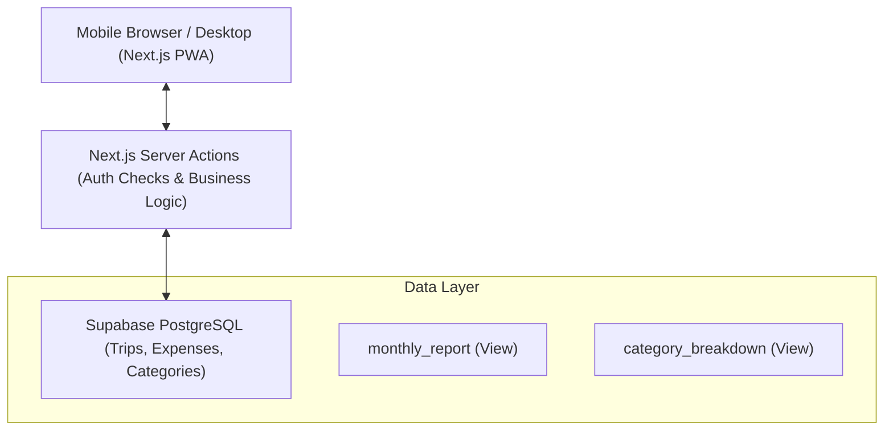

# Implementation Plan: Likh-lo (Truck Expense Tracker)

Likh-lo is a mobile-first truck expense tracking application designed for ease of use on the road. It replaces manual bookkeeping and fragmented digital records with a streamlined, cloud-synced solution.

## 1. Tech Stack
Based on the project requirements and current setup:
- **Frontend**: Next.js 15+ (App Router), Tailwind CSS 4.0, shadcn/ui
- **Backend**: Supabase (PostgreSQL, Auth, RLS)
- **State Management**: React Query (TanStack Query)
- **Charts**: Recharts
- **Deployment**: Vercel

## 2. System Architecture
The application follows a modern serverless architecture optimized for mobile performance and offline-ready capabilities.

## 3. Database Schema
Defined in `supabase/migrations/20240504000000_initial_schema.sql`.

### Tables
- **`trips`**: Core table for tracking journey details.
    - `id` (UUID PK)
    - `start_date` (Date)
    - `end_date` (Date, null if running)
    - `commodity` (Text)
    - `route` (Text)
    - `sell_amount` (Numeric)
    - `status` (Enum: 'running', 'completed')
    - `user_id` (FK to auth.users)
- **`expenses`**: High-frequency writes for daily costs.
    - `id` (UUID PK)
    - `trip_id` (FK to trips)
    - `category_id` (FK to categories)
    - `amount` (Numeric)
    - `date` (Date)
    - `user_id` (FK to auth.users)
- **`categories`**: Seeded with 18 defaults + user-created.
    - `id` (UUID PK)
    - `name` (Text)
    - `is_default` (Boolean)
    - `sort_order` (Int)

### Computed Views
- `monthly_report`: Aggregates total revenue, total expense, and net profit per user/month.
- `category_breakdown`: Calculates percentage of expense per category for visualization.

## 4. Development Phases

| Phase | Task | Focus | Est. Time |
|-------|------|-------|-----------|
| 1 | **Project Setup** | Next.js, Supabase Link, shadcn/ui | 2 hrs |
| 2 | **Database + Auth** | Migrations, RLS Policies, Magic Link Auth | 3 hrs |
| 3 | **Expense Entry UI** | **[Highest Priority]** Mobile-first grid, Numpad, Server Actions | 4 hrs |
| 4 | **Trip Management** | Create/Close trips, Status badges, Trip history | 3 hrs |
| 5 | **Dashboard + Reports** | Recharts (Bar/Ring), Monthly summary cards | 4 hrs |
| 6 | **Polish + Deploy** | PWA Manifest, Skeletons, Vercel Deployment | 2 hrs |

**Total Estimated Time**: ~18 Hours

## 5. Feature Map
### Trip Management
- Create trips with commodity + route.
- Status toggle: "Running" (active) vs "Completed".
- Auto-calculation of profit based on `sell_amount` minus `total_expenses`.

### Expense Entry (Mobile-First)
- **Grid Layout**: Large tap targets for quick category selection.
- **Optimistic UI**: Using React Query for instant feedback on expense addition.
- **Custom Categories**: Ability to add new categories that persist globally.

### Running Days Logic
A trip is "running" from `start_date` to `end_date` (inclusive).
- If `end_date` is null, `end_date = TODAY()`.
- Multiple trips in a month are summed; overlaps are handled via date-range unions in SQL.
- **Idle Days** = Total calendar days in month - Running days.

## 6. UI/UX Principles
- **One-Thumb Operation**: Key actions (adding expenses) reachable via thumb.
- **Dark Mode First**: Optimized for outdoor/night use.
- **PWA Benefits**: Installable on Android/iOS, bypassing app stores, providing a native-like feel.

---
*Created on: 2026-05-04*
